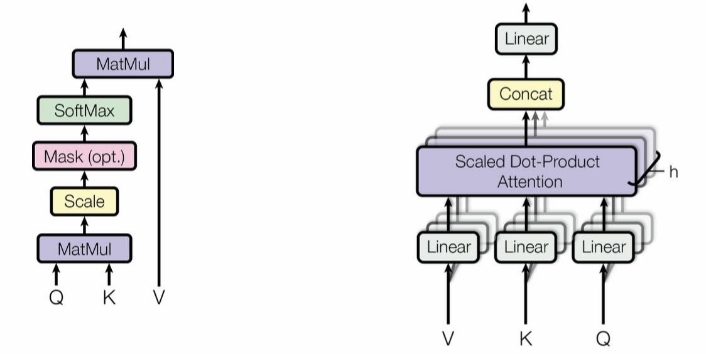

## Transformer

### 编码器与解码器（Encoder & Decoder）

- 编码器（左边）：
    - 输入序列数据，Embedding词向量，Position Encoding位置编码（正余弦函数）;
    - 随后数据分两路，一路输入单头或多头注意力机制，另一路残差连接直通到注意力机制后面（与注意力分数做加法），Add（求和）后再Norm（归一化）；
    - 然后数据仍分两路，一路输入前馈神经网络，另一路残差连接直通神经网络后面（与神经网络的输出做加法），Add（求和）后再Norm（归一化）；
    - 最后输出最终编码结果（Transformer论文的编码器中，Nx为6，也就是有6组一样的模块）
- 解码器（右边）：
    - 训练模式：
        - 解码器输入标签序列（即有监督学习的答案），Embedding词向量和Position Encoding位置编码（正余弦函数）;
        - 随后序列数据同样分两路，一路输入单头或多头注意力机制（这个注意力机制在编码器的基础上增加掩码机制），计算后得到注意力权重并和另一路残差连接直通数据做Add（加法）和Norm（归一化）
            - 因果掩码Causal Mask：标签序列会转换上三角矩阵，即矩阵对角线上部为无穷小数，也就是被掩盖的向量数据，以防止解码器看到未来的数据；但在推理模式下，随着输出token的增长，掩码的范围会开始扩展，但始终保持模型只能看到从开始到当前位置，之后的位置的信息全部掩码的因果约束
        - 输出掩码注意力，这个掩码注意力会和编码器输出的V和K一起再次输入注意力机制，计算后得到解码器的注意力输出和残差连接直通的掩码注意力做Add（加法）和Norm（归一化），然后输入前馈神经网络（解码器前馈神经网络部分和编码器的一致）
            - 如果是Decoder-only架构，则没有交叉注意力（即解码器中间没有编码器的输入），从掩码注意力输出直接连接到FNN
            - 编码器的输出结果输入解码器的中部位置，其输入结果为V和K
        - 最后输出最终解码结果（Transformer论文中，解码器的掩码注意力模块和注意力模块Nx为6，也就是有6组一样的模块）
    - 推理模式：
        - 在推理模式生成序列的过程中，生成的序列会再次输入解码器，再次Embedding词向量和Position Encoding位置编码（正余弦函数）；
        - 随后序列数据同样分两路，一路输入掩码注意力机制（对于未生成的token位置的注意力分数会被掩盖掉），计算后得到注意力权重并和另一路残差连接直通数据做Add（加法）和Norm（归一化）；
        - 输出掩码注意力，这个掩码注意力会和编码器输出的V和K一起再次输入注意力机制，计算后得到解码器的注意力输出和残差连接直通的掩码注意力做Add（加法）和Norm（归一化），然后输入前馈神经网络（解码器前馈神经网络部分和编码器的一致）
            - 如果是Decoder-only架构，则没有交叉注意力（即解码器中间没有编码器的输入），从掩码注意力输出直接连接到FNN
        - 最后输出最终解码结果（Transformer论文中，解码器的掩码注意力模块和注意力模块Nx为6，也就是有6组一样的模块）
    - 输出层：
        - 解码器中，前馈神经网络输出尺寸为（batch_size, token_num_in_seq, token_dim），
        - 最终将输入神经网络全连接线性层Linear，
            - 将语义向量空间映射到词汇表Vocabulary（即Embedding的逆向操作）
            - 全连接层计算方法
            
$$
DecoderOut\times W_{linear}+B_{linear}
$$
            
            - （其中W_linear词汇表权重矩阵尺寸为（token_dim, word_size)，B_linear词汇表偏置向量尺寸为word_size）
        - 词汇表映射完成后得到词汇表每个词的原始分数（该分数表示模型生成时，模型觉得下一个位置要生成某个词的相对可能性（即概率分布）
        - 最终使用softmax将这些分数归一化（将分数转换为标准概率，使其满足总概率和为1的概率定理）
        - 权重共享：最终映射到词汇表的权重矩阵（也就是神经网络全连接线性层的权重参数矩阵）和输入时embedding操场的权重参数矩阵共享
- 编解码器模块中的前馈神经网络架构
    - 注意力模块的输出输入前馈神经网络输入层，激活函数（ReLU、GELU等）接输出层
- Transformer层归一化（Layer Norm）与神经网络批归一化（Batch Norm）的差异
    - Layer Norm：将batch中每个token的各维向量作归一化（不贯穿batch），并且是水平方向
        - Layer Norm计算公式
            
$$
LayerNorm(x)=\frac{(x-\mu)}{\sqrt{(\sigma ^2 + \epsilon)}}*\gamma + \beta
$$

$$
（其中\epsilon 是防止分母为0的常数; \gamma(缩放因子) 和\beta(偏置) 为模型学习参数）
$$
            
    - Batch Norm：将每个batch的张量对应位置的数值作归一化（贯穿batch）

### 注意力机制（Attention Mechanism）

- （单头）注意力机制：
    - 当数据预处理（Embedding和Position Encoding）完成后，序列数据输入注意力机制，
    - 首先序列数据X分别与权重矩阵W_Q、W_K、W_V做矩阵乘法，得到Q、K、V三个矩阵
        - 其中权重矩阵W_Q、W_K、W_V是模型需要学习和更新迭代的参数，使用Xaiver初始化
    - 然后Q矩阵与K矩阵的转置做矩阵乘法后进行缩放（缩放因子1/sqrt(d_k)）得到注意力分数（K矩阵特征维度的平方根，以防止梯度饱和），缩放后使用softmax进行归一化得到注意力权重（使得序列中每个token对所有token的注意力权重和为1），归一化后的结果与V矩阵做矩阵乘法，得到注意力输出
        
$$
Attention=softmax(\frac{QK^T}{\sqrt{d_k}}) \cdot V
$$
        
        - softmax使用注意：因为计算的是自然底数的指数，指数需要控制（指数很大导致数值溢出），要求输入指数数值减去最大值来防止溢出
    - 最后与另一路残差连接直通的输入数据X进行Add（求和）和Norm（归一化）得到最终注意力输出，并输入前馈神经网络
- （多头）注意力机制：
    - 输入序列数据并预处理（Embedding和Position Encoding），其预处理方式与单头注意力机制一致；
    - 完成预处理后序列数据X输入注意力机制，指定头数heads_num（超参数），权重矩阵W_Q、W_K、W_V会被头数均等维度分割（权重矩阵生成时的尺寸为满足数据映射所需的尺寸）
        - 如词向量尺寸为(token_num, 512)，权重矩阵是(512, 512)，指定8头注意力，那么权重矩阵被平均分割为(8, 512, 512/8=64)
        - 头数必须是能被权重矩阵特征维度整除，（这个分割过程称为线性映射到向量子空间）
    - 随后输入数据X与分割后的权重矩阵做矩阵乘法得到多组Q、K、V三个矩阵，后续多组Q矩阵和K矩阵的转置做矩阵乘法（GPU并行计算）再进行缩放（缩放因子1/sqrt(d_k)）和归一化（softmax）再和V矩阵做矩阵乘法后得到四维张量（batch_size, heads_num, token_num_in_seq, token_dim）
        
$$
Attention=softmax(\frac{QK^T}{\sqrt{d_k}}) \cdot V
$$
        
        - 由于Transformer注意力模块后续连接的前馈神经网络需要三维张量，需要将四维转换回三维
            - 转换方式：对多组Q、K、V三矩阵分别进行水平拼接（concatenate），最终形成（batch_size, token_num_in_seq, heads_num*token_dim）
            - 如Q矩阵为（batch_size, 8, token_num_in_seq, 64）水平拼接后回到（batch_size, token_num_in_seq, 8*64=512）
    - 后续将与另一路残差连接直通的输入数据X进行Add（求和）和Norm（归一化）得到最终注意力输出，并输入前馈神经网络
- 自注意力机制：单头注意力机制只关注序列数据编码后，序列中单个token和自己所在序列中所有token、两两一对之间的重要性（相关性）（包含自己与自己的相关性）
- 交叉注意力机制：交叉注意力机制关注输入序列某一token和输出序列某一token两两一对的相关性（遍历两组序列中的所有token的两两组合）

### 掩码机制（Mask Mechanism）

- 编码器Mask：
    - 掩盖住序列填充的部分（填充部分的0向量只为对齐序列长度，无意义的信息不参与注意力计算）
    - 填充掩码矩阵PM，其尺寸为（batch_size，heads，seq_len，seq_len）
        - 矩阵元素：有效词向量部分为0，padding填充0向量为1（也可使用布尔值）
    - 注意力计算公式更新
        
$$
Attention=softmax(\frac{QK^T}{\sqrt{d_k}}+PM*-inf)\cdot V
$$
        
- 解码器Mask：
    - 训练时掩盖住真实标签的未来信息（因果掩码），推理时直接将输出的token再输入解码器（仍使用因果掩码）
    - 因果掩码矩阵CM尺寸为（batch_size，heads，seq_len，seq_len）（上三角方矩阵）
        - 矩阵元素：对角线及以下元素为0，对角线以上为1（也可使用布尔值）
    - 注意力计算公式更新
        
$$
Attention=softmax(\frac{QK^T}{\sqrt{d_k}}+CM*-inf)\cdot V
$$
        
- 编码器和解码器掩码矩阵融合：
    - 编码器的填充掩码矩阵和解码器的因果掩码矩阵融合需要对齐维度（自动扩展序列长度和特征维度，两者相加PM+CM，最终矩阵尺寸仍是（batch_size，heads，seq_len，seq_len）
- 自回归Decoder-only：可调节序列开始位置参数（即调节掩码矩阵对角线位置，使对角线向右偏移，使模型能在一开始能看到多个token后再进行生成，而不是只看到一个token就生成）

### 位置编码（Positional Encoding）

- 位置编码（正余弦函数编码）：
    - 对Embedding后的词向量矩阵的每一个元素进行位置编码计算
    - 其计算方式为：对偶数列的元素进行sin函数计算，对奇数列的元素进行cos函数计算
    - 函数计算完成后直接和原词向量求和，这样词向量包含了位置信息
    - 函数计算公式：
    
$$
SinPE_{(pos,2i)}= sin(pos \cdot 10000^{-\frac{2i}{d_{model}}})=sin(pos \cdot exp(-\frac{i*log(10000)}{d_{model}}))
$$
    
$$
CosPE_{(pos,2i+1)}= cos(pos \cdot 10000^{-\frac{2i}{d_{model}}})=cos(pos \cdot exp(-\frac{i*log(10000)}{d_{model}}))
$$
    

### 大模型训练模式（Training）

- 解码器输出的损失计算：softmax后输出序列尺寸（batch_size, seq_len, vocab_size）（标签序列尺寸同样），将其reshape成二维（batch_size*seq_len, vocab_size），使用交叉熵损失函数（CrossEntropy）来计算损失
- 训练技巧Teacher Forcing（教师强制）
    - 输入数据进入解码器时，序列会被滞后一个token单位，并在序列的第一个索引位添加开始标记Start of Sequence(SOS)以及在序列尾添加结束标记End of Sequence(EOS)。
    - 在训练时，将输入数据和预测真实标签输入分别输入编码器和解码器，模型始终使用真实标签的前半部分来预测后半部分（也就是死记硬背）；
    - 在推理时，由于没有预测真实标签，直接将解码器输出的序列再输入进解码器（也就是根据输入和模型已经说过的话来继续来生成序列）（这个方式就是自回归生成，又称GPT）
    - 弊端：Teacher Forcing能让大模型从零开始快速学习知识，但带来训练-推理不一致问题。大模型本质上只是在最大化下一个token的概率，而不具备对“回答是否有用、是否真实”的认知。后续需要使用RLHF（基与人类反馈的强化学习），使大模型从“概率最大化”转向“人类偏好最大化”，提升了回答的有用性、自然性与安全性，但RLHF的奖励模型本身只刻画“人类更喜欢什么”，而不是“什么是客观真实”。因此，大模型可能会生成“语言质量高、逻辑完整但事实错误”的回答，从而加剧Hallucination（幻觉）风险。

### 大模型推理模式（Reasoning）

- 解码器输出状态保存：取模型生成的最后一个位置的输出，输入神经网络全连接层，并softmax归一化后的概率分布尺寸为（batch_size, 1, vocab_size），下一个要生成的词将选择最大概率的词，并添加到生成序列的末尾，直到生成结束（这种方式为流式输出Streaming Output）
- 线性映射后归一化前可增加缩放：增加温度参数（控制分数分布的尖锐程度）
    - 当温度参数大于1时：分布更平滑、探索性更强（候选词之间的分数比较平滑差不多）；
    - 当温度参数小于1时：分布更尖锐，稳定性更强（候选词之间的分数方差比较大，回答用词比较稳定）；
    - 当温度参数为0时：贪婪搜索（即直接取最大分数的词）
- 推理时Top-p采样策略：
    - Top-p：按照概率值对候选词进行排序（降序），然后从第一个开始往后计算累计概率和，当累计概率和达到Top-p参数时，后面未参与计算的候选词被丢弃，剩下的候选词再次进行归一化后，模型会随机选择某一个候选词进行回答
